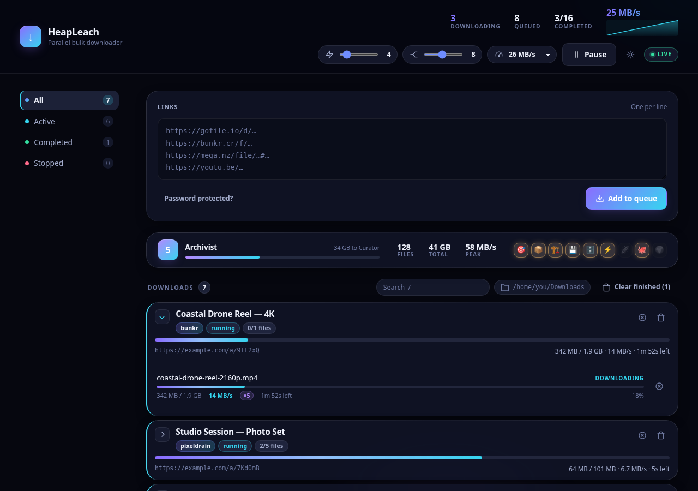
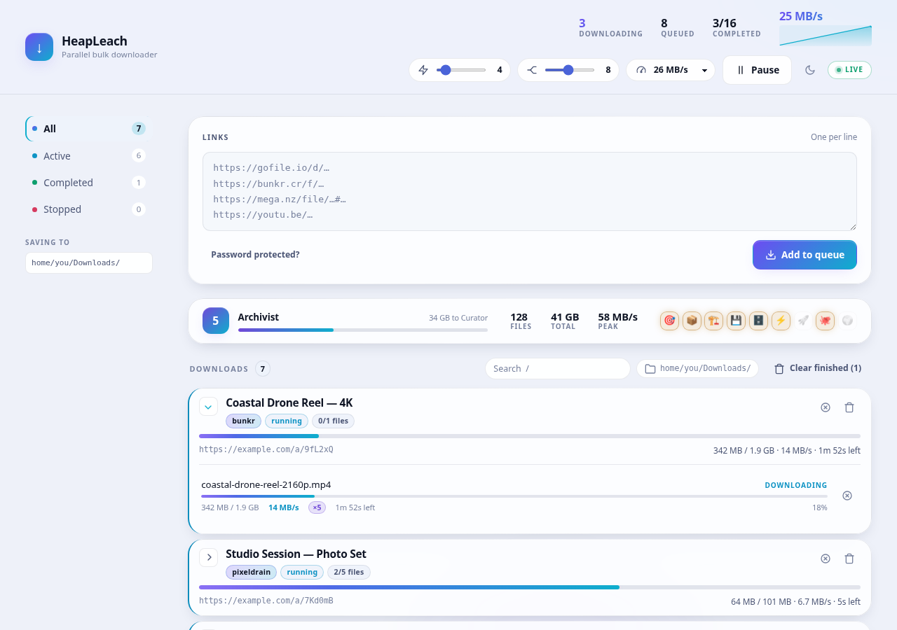
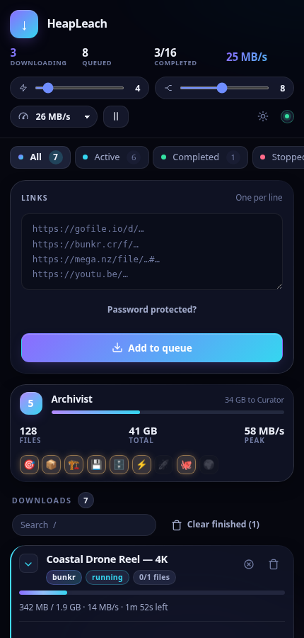
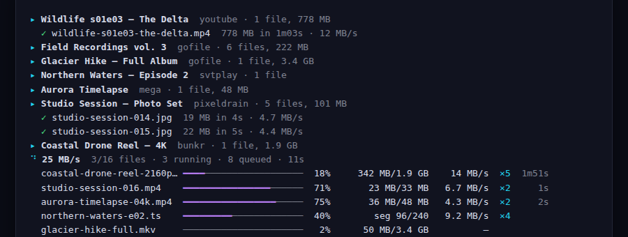

# HeapLeach

A bulk downloader: paste a pile of links, watch them download in parallel,
cancel or retry any of them mid-flight.

> **About the name.** Heap leaching is a mining method: crushed ore is piled
> into a heap and irrigated from above, and the solution percolates down
> through it, dissolving out the metal as it goes and draining to a pad at
> the bottom. This does the same to a heap of links. The extractors percolate
> through whatever the pages are made of — players, listings, signed
> redirects, encrypted payloads — and what is worth keeping drains out into a
> folder.

- **Backend** — Go. Worker pool, per-host extractors, resumable transfers.
- **Frontend** — TypeScript + React, compiled and **embedded into the Go
  binary**. One file to ship, nothing to serve from disk.
- **Build** — runs entirely in Docker; the binary is exported to your host.
- **Two ways to run** — serve the UI, or hand it URLs on the command line and
  watch them download in the terminal.

## Screenshots

<p align="center">
  
</p>

Light and dark follow the system by default; the header toggle overrides it,
and the choice is remembered. The layout collapses to a single column on a
phone, with the filters becoming a scrolling strip.

<p align="center">
  
  
</p>

Given URLs instead of a directory, it skips the browser entirely and animates
the same progress on the terminal:

<p align="center">
  
</p>


## Quick start

Grab a build from [releases](https://github.com/JohanLindvall/HeapLeach/releases)
— Linux (x86-64, arm64), macOS (Intel, Apple silicon) and Windows — unpack it
and run it. It is one static binary with the UI inside; there is nothing to
install alongside.

```bash
tar -xzf heapleach_*_linux_amd64.tar.gz
./heapleach                 # serves the UI, saving to your Downloads folder
```

Or build it yourself:

```bash
make run        # builds if needed, serves on your Downloads folder on a free
                # port, and opens your browser at the address it picked
```

Or build and run it yourself:

```bash
make build                  # builds in Docker, writes ./bin/heapleach
./bin/heapleach ~/Downloads     # serves http://localhost:8080
```

No local Go or Node needed — the toolchain lives in the build image, and only
the finished binary lands on your machine.

Prefer to run it as a container:

```bash
make run-image                 # builds the image and runs it
```

`make run` and `make run-image` save to `~/Downloads`; override with
`make run DOWNLOADS=/mnt/media`.

`make run` binds port 0, so it never collides with something already
listening; the process reports the address it was given and opens it. Pin one
with `make run ADDR=:8080`.

## Usage

```
heapleach [options] [download-dir]            serve the web UI
heapleach [options] <url>... [download-dir]   download and exit

  -addr string          listen address; :0 takes any free port (default ":8080")
  -concurrency int      parallel transfers, 1-32 (default 4)
  -dir string           directory to download into
  -password string      password for protected sources (headless downloads)
  -retries int          retries per request and per transfer (default 3)
  -streams int          connections to split a slow file across (default 8)
  -slow-speed int       bytes/sec below which extra connections open (default 2000000)
  -max-speed int        ceiling on total download rate in bytes/sec (0 is unlimited)
  -stall-timeout dur    abandon and retry a transfer stuck this long (default 1m30s)
  -debug                verbose logging
  -open                 open the UI in a browser once it is listening
  -version              print the version and exit
```

### On the command line

Hand it URLs and it never opens a socket: the files are downloaded to disk,
progress is animated on the terminal, and the process exits.

```bash
heapleach https://example.com/d/abc123 ~/Downloads
heapleach -streams 8 https://example.com/a/one https://example.com/a/two
cat urls.txt | heapleach - ~/Downloads          # "-" reads a list from stdin
```

URLs and the download directory can come in either order — a URL is anything
with an `http(s)` scheme, so the two can never be confused. Lists read from
stdin ignore blank lines and `#` comments.

It exits `0` when every file arrived, `1` when any failed — and each failure
is named — so it drops straight into a script or a cron job. `Ctrl-C` exits
`130` and leaves the partial files in place; running the same command again
continues them rather than starting over.

Everything the server does, this does: the same extractors, the same
multi-connection transfers, the same resume. When stdout is not a terminal
— a pipe, a log file, CI — the animation is replaced by plain progress
lines at a slower cadence, and `-debug` does the same so log output and the
display never fight over the screen.

The download directory can be given three ways. The most explicit wins:

```bash
heapleach /mnt/media                    # argument
heapleach -dir /mnt/media               # flag
HEAPLEACH_DIR=/mnt/media heapleach           # environment
heapleach -concurrency 8 -addr :9000 ~/Downloads
```

It is created if missing, `~` is expanded, and the process refuses to start
if the directory cannot be written to — so a permission problem surfaces
once, up front, instead of as a wall of failed transfers.

## Supported links

| Host | Accepts | How it resolves |
|---|---|---|
| **gofile** | `/d/<code>` | Mints a guest token, then signs each API call with `sha256(ua :: lang :: token :: 4h-slot :: secret)` in an `X-Website-Token` header. The secret is rotated server-side, so it is read out of gofile's own obfuscated script rather than pinned: its string table is RC4 under a shuffled base64 alphabet, and the one rotation that decodes the whole file is what proves the answer. A signature gofile rejects is not repeated — it blocks addresses that sign badly. Downloads carry the token as a cookie. Walks nested folders. |
| **bunkr** | `/f/<slug>`, `/a/<slug>`, any `bunkr*` domain | Page → numeric file id → metadata endpoint → separate signing service for the `token`/`ex` pair the CDN demands. |
| **pixeldrain** | `/l/<id>`, `/u/<id>`, `/f/<id>` | Public JSON API. |
| **turbo** | `/embed/<id>`, `/d/<id>` | `/api/sign` issues a short-lived signed URL. |
| **mega** | `/file/<id>#<key>`, `/folder/<id>#<key>`, and the older `#!`/`#F!` shapes | Nothing about a mega link is legible to the server: names, sizes and bytes are all encrypted under the key in the fragment. Attributes decrypt with AES-CBC; the payload is AES-CTR, undone as the bytes arrive, so ranges, resume and parallel connections all still apply. A link quoted without its `#` fragment cannot be opened by anyone. |
| **dropbox** | `/s/…`, `/scl/fi/…`, folder shares | Asks for `dl=1`, with the content host kept as a mirror to fail over to. A folder share downloads as the zip dropbox builds for it. |
| **mediafire** | `/file/<key>/<name>`, `/folder/<key>` | The download link is on the file page, signed per visit, so the page is re-read when the item starts. Folders come from mediafire's own listing API, recursively. |
| **google drive** | `/file/d/<id>`, `?id=<id>` | Walks past the virus-scan confirmation page — HTML, with a token minted per visit — so the transfer is handed real bytes. Folder links need an API key and are not supported. |
| **svtplay** | `/video/<id>/…`, `/<programme>` | Open player API. A programme expands to every episode, grouped into season folders where there is more than one season, read from SVT's GraphQL API rather than the page (which mixes in trailers and recommendations). |
| **youtube** | videos and playlists | Handed to yt-dlp, which is the only practical way in: YouTube withholds playback URLs behind BotGuard attestation on top of its signature and throttling parameters. Needs `make dependencies`. |
| **odysee, dailymotion, bilibili, niconico, rumble, bandcamp, soundcloud, mixcloud** | videos and tracks | Also handed to yt-dlp, each for a reason recorded in the code so nobody re-derives it: Bilibili signs its playback URLs and ships demuxed DASH; Niconico's HLS is demuxed too, so there is nothing self-contained to fetch; Dailymotion fingerprints TLS and no longer offers a progressive rendition; Bandcamp answers with a client challenge; SoundCloud needs a client id scraped from a rotating bundle; Mixcloud obfuscates its stream URLs; Rumble puts an interstitial in front of its media endpoint. Needs `make dependencies`. |
| **vimeo** | `/<id>`, `/<id>/<hash>`, channel and group links, `player.vimeo.com/video/<id>` | Everything goes through the **embed player** rather than the watch page: the watch page answers a non-browser client with a bot check, and yt-dlp's own path through it demands an account, while the player URL an iframe loads is served to anyone. The stream is demuxed — video renditions plus a separate audio group — and carries no progressive MP4, so yt-dlp muxes it. Needs `make dependencies`. |
| **booru** | tag searches and posts on 16 image boards | One adapter per API family — Danbooru, e621, Moebooru, Gelbooru 0.2, Philomena — which is how a handful of engines covers a lot of sites. |
| **4chan** | `/<board>/thread/<id>` | The site's read-only JSON API; every attachment in a thread. |
| **streamtape, doodstream, mixdrop** | watch and embed pages | Each assembles its link inside the player: two halves joined at an offset the page states, a token endpoint plus a random tail, or a packed script naming the delivery host. Every one of them reads the numbers it needs off the page rather than hard-coding what they were. |
| **pixhost** | `/gallery/<code>`, `/show/<group>/<file>` | A gallery's thumbnails say where the full images are: the two links differ only by host prefix and one path segment. Deriving them resolves a gallery of fifty in one request instead of fifty, and a mapping that ever changed would fail visibly with a 404 rather than quietly fetching thumbnails. |
| **suvobox** | `/a/<id>`, `/f/<id>` | The album listing states every file's id, its full name with extension and its size, so a whole album resolves in one request with real names in the queue from the start. The bytes come from the media host's `?raw=1`, which needs no token — the site's own signed `?dl=1` link would only expire while an item waited its turn. |
| **imagepond** | `/i/<code>`, and the title-slug form of the same page | The metadata names the item, but for a video it names the *poster frame*, and it has been seen misreporting a QuickTime file as MP4 — so the player element's own `data-src` is read first and the metadata is the fallback. Profile pages list their items client-side and are not supported. |
| **yandex** | `/video/preview/<id>`, on any of its country domains | Yandex hosts none of this: a preview is a viewer wrapped around somebody else's video, and the page links the source beside the player. That link is what is followed, and the video is left to yt-dlp, which knows far more hosts than this program does. Needs `make dependencies`. |
| **ok.ru** | `/video/<id>`, `/videoembed/<id>` | The watch page carries an empty rendition list for a logged-out caller, and the player's metadata endpoint answers the same way; the embed page, which exists to be framed elsewhere, carries the same structure filled in. Links are signed with an expiry and the requesting address, so they resolve at download time. |
| **imgur** | `/a/<id>`, `/gallery/<slug>-<id>`, `/<id>`, `/user/<name>`, `/r/<sub>` | The album page carries the same JSON the API returns, so no key is needed — and none is accepted either; the header imgur's own web app sends is not validated. A deleted image redirects to a real 503-byte PNG with a correct length that answers a ranged request, which no general rule can catch, so the extractor recognises that dead end itself. |
| **cyberdrop** | `/a/<id>`, `/f/<slug>` | bunkr's sibling. The album page states every filename and exact size in one request; the signed link is minted per attempt, which is what lets a file that will not sign fail on its own rather than sinking the album. |
| **archive.org** | `/details/<id>`, `/download/<id>` | One metadata call lists every file with an exact length and checksum. It is fetched **gently** — one connection, one file at a time — because archive.org answers parallelism with a clean 206 served 300× slower, per address, for minutes afterwards. A collection identifier is refused rather than "succeeding" by fetching five site logos. |
| **bitchute** | `/video/<id>`, `/channel/<name>` | Two unsigned JSON posts give a permanent MP4. Eleven seed hosts serve each other's paths byte-identically, so they are kept as mirrors — failover onto a set that cannot be wrong. |
| **civitai** | `/images/<id>`, `/posts/<id>`, `/models/<id>`, `/user/<name>/images` | Documented public JSON, unsigned content-addressed CDN. Collection links are deliberately **not** matched: the API silently ignores that parameter and returns the site's front page instead, which would look like a successful download of the wrong thing. |
| **pornpics** | `/galleries/<slug>-<id>/`, categories, `/pornstars/`, `/channels/` | A gallery's full-size URLs are in the page, so one request resolves it. Listings take one of two pagination routes, and the wrong one returns the first 20 items forever while looking like it works. |
| **chevereto** (family) | imgbb, freeimage, gifyu, and any install | One extractor for the image-host product, recognised by its own `generator` tag, so an unlisted install works without a rebuild. imagepond turned out to be one of these all along, handling only single images. |
| **peertube** (family) | `/w/<id>`, `/videos/watch/<id>`, channels, accounts | ~1,795 federated instances behind one versioned API, confirmed by a version probe rather than guessed from markup. Unsigned, rangeable, exact lengths. A federated video's file may live on a different instance than the one asked, and the API says which. |
| **fediverse** (family) | Mastodon, Pleroma, Pixelfed, Lemmy, Misskey | Found through `/.well-known/nodeinfo`, which is a specification rather than a list, so the table cannot go stale. Three API dialects behind one sniff. |
| **foolfuuka** (family) | `/{board}/thread/<n>` on the 4chan archives | Where threads persist after 4chan drops them, through an API modelled on 4chan's own — and better than it, since each post carries the poster's original filename and an exact size. |
| **mediawiki** (family) | `Category:`, `File:`, articles, on any wiki | Commons, every Wikipedia, Fandom, any open wiki. A documented, versioned, keyless API returning untouched originals — the least likely thing here ever to break. |
| **nrk** | `/serie/<slug>`, `/program/<id>` | svtplay's sibling: DRM-marked assets are skipped, and the site's own geo-block message is passed through verbatim rather than replaced with a guess. |
| **vidmoly, streamable, wetransfer, suvobox** | see above | Vidmoly is the highest-traffic embed host here; three of its four advertised domains are dead, so everything routes through the one that works. |
| **feeds** | any RSS or Atom feed | One file per `<enclosure>`, oldest first, since an archive wants the beginning. |
| *a bare `.m3u8`* | any adaptive manifest | Joined into a playable file. A `.mpd` is refused with a reason rather than saved: DASH is usually demuxed, so concatenating it would yield a silent video. |
| *a directory listing* | Apache, nginx, lighttpd autoindex | Walked recursively, with sizes and structure taken from the listing. Also covers IPFS gateway directories. |
| *`links:<url>`* | any public page | Reads the page and downloads every link a supported host claims, each into its own folder. Aimed at the forum thread with two hundred links in it. |
| *anything else* | any `http(s)` URL | Treated as a direct file link — but the page is checked first for a player, a manifest, a directory index or a known platform, so pasting a video page no longer saves the HTML shell. |

Several of these hand out URLs that expire in minutes, so bunkr, turbo,
mega, mediafire, ok.ru, cyberdrop, streamable, wetransfer and the three
streaming hosts are **resolved at download time**, not when the link is
queued — otherwise a large queue would start failing halfway down.

Five of the entries above are **platform families**: one extractor covering
every site running a piece of software, rather than one per site. That is
where the reach comes from — the KVS row is seven named tube sites plus an
unbounded tail recognised by the shape of its URLs, the booru row is twenty
boards through six API families, and PeerTube alone is some 1,795 instances.
A family is always the better trade, and the ones here key off something that
cannot rot: a version endpoint, a `generator` tag, or the `nodeinfo`
specification.

Three more entries are not hosts at all but **shapes** — an adaptive
manifest, an open directory, and any page carrying a video in its markup.
Those cover the sites nobody will ever get round to naming.

### Every supported site

Generated from the registry by `make hosts`, so it cannot drift from the
code: adding a host to `NewRegistry` is the only step, and CI fails if this
section and the binary disagree.

<!-- BEGIN HOSTS -->
<!-- Generated by `make hosts`. Do not edit by hand. -->

148 sites across 67 extractors, plus 6 that match by shape rather than by host.

| Extractor | Sites |
|---|---|
| `4chan` | `4chan.org`, `4channel.org` |
| `archive.org` | `archive.org` |
| `bandcamp` | `bandcamp.com` |
| `bilibili` | `b23.tv`, `bilibili.com` |
| `bitchute` | `bitchute.com` |
| `blender` | `video.blender.org` |
| `booru` | `aibooru.online`, `booru.borvar.art`, `booru.foalcon.com`, `booru.org`, `derpibooru.org`, `e621.net`, `e6ai.net`, `e926.net`, `furbooru.org`, `hypnohub.net`, `konachan.com`, `konachan.net`, `ponybooru.org`, `safebooru.org`, `sakugabooru.com`, `snootbooru.com`, `tbib.org`, `twibooru.org`, `xbooru.com`, `yande.re` |
| `bunkr` | `bunkr.*` |
| `camwhores` | `camwhores.tv` |
| `civitai` | `civitai.com` |
| `coomerfans` | `coomerfans.com` |
| `cyberdrop` | `cyberdrop.cr` |
| `dailymotion` | `dai.ly`, `dailymotion.com` |
| `desuarchive` | `desuarchive.org`, `rbt.asia` |
| `doodstream` | `d0o0d.com`, `do0od.com`, `dood.la`, `dood.li`, `dood.re`, `dood.sh`, `dood.so`, `dood.to`, `dood.watch`, `dood.ws`, `dood.yt`, `doodstream.com`, `dooood.com`, `ds2play.com`, `vidply.com` |
| `drive` | `docs.google.com`, `drive.google.com`, `drive.usercontent.google.com` |
| `dropbox` | `dropbox.com`, `dropboxusercontent.com` |
| `erome` | `erome.com` |
| `fapello` | `fapello.com` |
| `fapster` | `fapster.xyz` |
| `framatube` | `framatube.org` |
| `freeimage` | `freeimage.host` |
| `gifyu` | `gifyu.com` |
| `gofile` | `gofile.io` |
| `imagepond` | `imagepond.net` |
| `imgbb` | `ibb.co`, `imgbb.com` |
| `imgur` | `imgur.com` |
| `kemono` | `coomer.party`, `coomer.st`, `coomer.su`, `kemono.cr`, `kemono.party`, `kemono.st`, `kemono.su` |
| `kolektiva` | `kolektiva.media` |
| `makertube` | `makertube.net` |
| `mediafire` | `mediafire.com` |
| `mega` | `mega.co.nz`, `mega.nz` |
| `mixcloud` | `mixcloud.com` |
| `mixdrop` | `mdbekjwqa.pw`, `mixdrop.ag`, `mixdrop.bz`, `mixdrop.ch`, `mixdrop.club`, `mixdrop.co`, `mixdrop.gl`, `mixdrop.is`, `mixdrop.my`, `mixdrop.ps`, `mixdrop.sx`, `mixdrop.to`, `mixdrp.co`, `mixdrp.to` |
| `niconico` | `nico.ms`, `nicovideo.jp` |
| `nrk` | `nrk.no`, `tv.nrk.no` |
| `odysee` | `lbry.tv`, `odysee.com` |
| `ok.ru` | `odnoklassniki.ru`, `ok.ru` |
| `palanq` | `archive.palanq.win` |
| `pixeldrain` | `nova.storage`, `pixeldrain.com` |
| `pixhost` | `pixhost.to` |
| `pornhits` | `pornhits.com` |
| `pornhub` | `pornhub.com` |
| `pornone` | `pornone.com` |
| `pornpics` | `pornpics.com` |
| `porntrex` | `porntrex.com` |
| `pornzog` | `pornzog.com` |
| `redgifs` | `redgifs.com` |
| `rumble` | `rumble.com` |
| `sexvid` | `sexvid.xxx` |
| `soundcloud` | `soundcloud.com` |
| `spectra` | `spectra.video` |
| `streamable` | `streamable.com` |
| `streamtape` | `strcloud.link`, `streamta.pe`, `streamtape.cc`, `streamtape.com`, `streamtape.net`, `streamtape.site`, `streamtape.to`, `streamtape.xyz` |
| `suvobox` | `suvobox.com` |
| `svtplay` | `svtplay.se` |
| `tchncs` | `tube.tchncs.de` |
| `thisvid` | `thisvid.com` |
| `tilvids` | `tilvids.com` |
| `tnaflix` | `tnaflix.com` |
| `turbo` | `turbo.cr`, `turbocdn.st` |
| `vidmoly` | `vidmoly.biz`, `vidmoly.me`, `vidmoly.net`, `vidmoly.to` |
| `vimeo` | `player.vimeo.com`, `vimeo.com` |
| `wetransfer` | `we.tl`, `wetransfer.com` |
| `xhamster` | `xhamster.*` |
| `yandex` | `yandex.*` |
| `youtube` | `youtu.be`, `youtube-nocookie.com`, `youtube.com` |

And these match a URL or document shape, so the set of sites they reach is open-ended:

| Extractor | Recognises |
|---|---|
| `autoindex` | an open directory listing (Apache, nginx, lighttpd) |
| `fediverse` | an instance publishing `/.well-known/nodeinfo` — Mastodon, Pleroma, Pixelfed, Lemmy, Misskey |
| `feed` | an RSS or Atom feed, by its enclosures |
| `hls` | an adaptive manifest (`.m3u8`), from any host |
| `links` | a `links:<url>` prefix — every supported link on the page |
| `mediawiki` | any wiki with an open `api.php` — Commons, Wikipedia, Fandom |
<!-- END HOSTS -->

Where a host offers the same file from more than one place — gofile's
storage servers, dropbox's two front ends — the alternatives are kept as
mirrors and a failed attempt lands on a different one.

SVT Play is an adaptive stream, so it has no single file to fetch. The
extractor picks a rendition carrying **audio and video together**, which
means the segments join into a playable file with no muxing at all.

Any finished `.ts` is rewrapped to `.mp4` when `ffmpeg` is available. The
rewrap is always a stream copy, so nothing is ever re-encoded: if the
streams cannot enter MP4 untouched, the `.ts` is kept instead. What comes
over is the best video plus the best audio and subtitle track **of each
language**, so a recording that shipped in several languages stays usable in
all of them without also carrying the duplicate encodes within each. Without
ffmpeg the `.ts` is kept and plays fine.

## Features

- **Parallel downloads** with a live worker count you can change while
  transfers are running.
- **Multi-connection transfers.** A file that is downloading slowly is split
  across more connections, up to a configurable ceiling. Ranges are chosen by
  bisecting whatever is still outstanding — halfway, then the quarters, then
  the eighths — so the extra connections share the remaining work rather than
  duplicating it. Throughput is averaged over a window before any decision is
  made, so one noisy interval never triggers a change.
- **Host-aware.** Hosts cap how many connections they will accept. Extra
  connections are budgeted per host across all downloads, and a host that
  turns one away has its range handed straight back and its budget lowered,
  so a working download is never failed by trying to go faster.
- **Patient with busy hosts.** Gofile answers a request for a file on a busy
  storage server by redirecting to its own web page. That is detected rather
  than saved to disk, and retried with backoff — rotating through the file's
  other storage servers where it has them — because a busy host has not
  failed, it has asked us to come back. Patience is spent only where trying
  again can change the answer: a URL with nothing to re-resolve, which is
  usually a page no extractor recognised, is told so after a few attempts
  instead of retrying forever.
- **Pause and resume** the whole queue. Transfers park inside their reads
  rather than being torn down, so a short pause costs nothing and a long one
  falls back on the same resume every other interruption uses.
- **A ceiling on total throughput**, set from the header or with `-max-speed`.
  It is one shared budget across every connection, not a per-file allowance —
  and the code that opens extra connections knows about it, so a transfer
  held at the ceiling is not mistaken for a slow one and split eight ways for
  nothing.
- **Skips what is already there.** A file whose name and length already match
  the destination is not downloaded again — checked against the length the
  server reports, so it works even for hosts that publish no sizes. Sizes
  read off listing pages are rounded, and are never used to make that call.
- **Notices a stalled transfer.** A connection that stops delivering without
  closing is invisible to a read timeout; if the byte counter has not moved
  for `-stall-timeout`, the attempt is abandoned and retried, resuming from
  what is on disk. Playlist downloads are watched the same way, against the
  bytes actually arriving rather than against whole parts landing — a large
  part fetched slowly is progress, a silent connection is not.
- **Live progress** over server-sent events: per-file bytes, rate, ETA, and
  parts joined for a file that arrives as a playlist and so has no byte total
  until its last part lands. A transfer waiting on purpose says so, rather
  than looking like one that has died.
- **A searchable queue.** Type `/` and filter hundreds of jobs by title,
  source, host or filename; `Esc` clears. Scrolling is not a retrieval
  strategy.
- **Cancel and retry** a whole job or a single file.
- **Resume** — partial files are kept and continued with a `Range` request;
  a cancelled 100 MB download restarts where it stopped.
- **Password-protected folders** (gofile).
- **Safe filenames** — remote names are reduced to one portable path
  component, so nothing can be written outside the download directory.
- A light **progression layer**: ranks, session totals and a few badges.

### Image boards

Boards sharing an API are covered by one adapter each, in the style
gallery-dl uses:

| Family | Boards |
|---|---|
| Danbooru | aibooru, booruvar |
| e621 | e621, e926, e6ai |
| Moebooru | yande.re, konachan, sakugabooru |
| Gelbooru 0.2 | safebooru, tbib, hypnohub, xbooru |
| Philomena | derpibooru, ponybooru, furbooru, twibooru |

Paste a tag search or a post link. A listing with no tags fetches the
board's latest posts; a bare domain is rejected, since that is far more
likely a mis-paste than a request for everything.

Every board above was checked against its live API. Ones that now demand an
API key (gelbooru.com), sit behind a challenge (danbooru.donmai.us) or have
switched their API off (realbooru) are deliberately absent rather than
listed as supported and quietly broken.

## Optional helpers

YouTube needs `yt-dlp`; `ffmpeg` lets SVT Play output `.mp4` instead of `.ts`
and lets YouTube merge separate video and audio tracks. Neither is required
for the other hosts.

```bash
make dependencies    # static yt-dlp + ffmpeg into ./bin
```

The service looks for these **next to the heapleach binary first**, then on
PATH — so the copies in `./bin` are picked up without touching the system.

The YouTube download itself runs through `yt-download.sh` rather than inline
Go, so the recipe is in one readable place. A copy of that script placed
beside the binary overrides the built-in one, so it can be adjusted without
rebuilding.

## Configuration

Every setting has an environment variable; the common ones also have a flag,
and a flag beats the environment.

| Variable | Default | Meaning |
|---|---|---|
| `HEAPLEACH_ADDR` | `:8080` | Listen address. Flag: `-addr`. |
| `HEAPLEACH_DIR` | your Downloads folder | Where files are written. Defaults to the platform's own download folder — `~/Downloads` on macOS and Windows, and on Linux whatever the desktop's XDG user-dirs file says, which is where a relocated or localised folder is recorded. The container image uses `/downloads` instead, having no home directory to speak of. Flag: `-dir`, or the positional argument. |
| `HEAPLEACH_CONCURRENCY` | `4` | Parallel transfers (1–32). Flag: `-concurrency`. |
| `HEAPLEACH_MAX_RETRIES` | `3` | Retries per request and per transfer. Flag: `-retries`. A busy host is exempt and retries forever. |
| `HEAPLEACH_STREAMS` | `8` | Connections one slow file may be split across (1–16). Flag: `-streams`. Also settable live in the UI. |
| `HEAPLEACH_SLOW_SPEED` | `2000000` | Bytes/sec below which extra connections are opened. Flag: `-slow-speed`. |
| `HEAPLEACH_MAX_SPEED` | `0` | Ceiling on total download rate in bytes/sec; `0` is unlimited. Flag: `-max-speed`. |
| `HEAPLEACH_STALL_TIMEOUT` | `90s` | How long a transfer may make no progress before the attempt is retried. Flag: `-stall-timeout`. |
| `HEAPLEACH_USER_AGENT` | a current desktop Chrome UA | Sent on every request. Gofile mixes it into its signature, so it must match what signs. |
| `HEAPLEACH_LANGUAGE` | `en-US` | `Accept-Language`, and part of the gofile signature. |
| `HEAPLEACH_GOFILE_SECRET` | read from gofile | The secret gofile signs requests with. It is normally recovered from gofile's own script and cached for as long as that script says it is good for, so this is only needed if that ever stops working — setting it overrides the lookup entirely. |
| `HEAPLEACH_EXTRA_HOSTS` | unset | Extra hosts for a platform family, as `family:host,host;family:host` — for example `peertube:tube.example;kvs:tube2.example`. Every family here is software many sites run, so a list compiled into a binary can only ever trail them; this adds installs without a rebuild. Families: `kvs`, `peertube`, `chevereto`, `foolfuuka`, `fediverse`. |
| `HEAPLEACH_KVS_HOSTS` | unset | The original KVS-only form of the above, still honoured. |
| `HEAPLEACH_DEBUG` | unset | Debug logging. Flag: `-debug`. |
| `HEAPLEACH_OPEN` | unset | Open a browser once listening. Flag: `-open`. |

## HTTP API

| Method | Path | Purpose |
|---|---|---|
| `GET` | `/api/health` | Liveness. |
| `GET` | `/api/state` | Current snapshot. |
| `GET` | `/api/events` | SSE stream of snapshots. |
| `POST` | `/api/downloads` | `{"urls": "…", "password": "…"}` — newline-separated or an array. |
| `POST` | `/api/settings` | `{"concurrency": n, "streams": n}` |
| `POST` | `/api/clear` | Forget finished jobs. |
| `POST` | `/api/jobs/{id}/cancel` · `/retry` | Whole job. |
| `DELETE` | `/api/jobs/{id}` | Cancel and forget. |
| `POST` | `/api/jobs/{id}/items/{itemId}/cancel` · `/retry` | One file. |

```bash
curl -X POST localhost:8080/api/downloads \
  -H 'Content-Type: application/json' \
  -d '{"urls":"https://pixeldrain.com/l/<id>"}'
```

## Development

```bash
make run          # build if needed, serve on a free port, open a browser
make run-image    # same, but from the container image
make dev          # Go API on :8080 + Vite dev server on :5173 (hot reload)
make dev-backend  # API only
make test         # Go unit tests
make test-live    # extractors against the real sites (needs network)
make frontend     # build the UI into the Go embed directory
make lock         # regenerate frontend/package-lock.json
make dist         # cross-compile the release archives into ./dist
make tag V=v0.1.0 # tag a release; CI builds and publishes the binaries
make help         # every target
```

`make dev` needs Go and Node locally. Everything else falls back to Docker.

### Layout

```
backend/
  cmd/heapleach/        entry point
  internal/config/  settings and every shared tunable constant
  internal/util/    shared helpers (no dependencies)
  internal/httpx/   HTTP client: browser headers, redirects, retry/backoff
  internal/extractor/  one file per host + a direct-link fallback
  internal/download/   worker pool, resumable transfers, progress
  internal/server/     JSON API, SSE, embedded-asset serving
  internal/webui/dist/ the compiled frontend (go:embed)
frontend/           React + TypeScript (strict), built by Vite
```

Dependencies point one way only: `config` and `util` at the base, then
`httpx`, then `extractor`, then `download`, then `server`.

### Adding a host

Implement `extractor.Extractor` (`Name`, `Match`, `Extract`) and register it
in `NewRegistry`. Return a `File` per download; set `Resolve` instead of
`URL` when the host issues links that expire.

### Releases

Every push and pull request runs the tests, `go vet` and a `gofmt` check, with
the UI compiled first so the binary is built against the real embedded
frontend rather than the placeholder.

Pushing a `v*` tag builds the release. One Linux runner produces every
archive, because the program is pure Go with cgo off and the targets differ
only by `GOOS` and `GOARCH`:

| Archive | For |
|---|---|
| `heapleach_<tag>_linux_amd64.tar.gz` | Linux, x86-64 |
| `heapleach_<tag>_linux_arm64.tar.gz` | Linux, arm64 |
| `heapleach_<tag>_darwin_amd64.tar.gz` | macOS, Intel |
| `heapleach_<tag>_darwin_arm64.tar.gz` | macOS, Apple silicon |
| `heapleach_<tag>_windows_amd64.zip` | Windows, x86-64 |

Each carries the binary, the README and the licence, and `SHA256SUMS` covers
the set. `make dist` builds exactly the same archives locally, which is the
way to check a release before tagging one.

## Notes

- Jobs live in memory. Restarting loses the queue; finished files stay put.
  A `.part` file carries a `.part.state` sidecar recording per-connection
  progress, so an interrupted multi-connection transfer resumes rather than
  starting over. Both can be deleted safely.
- These sites change their plumbing without warning. `make test-live` is the
  fastest way to find out which extractor broke.
- Be a good citizen: the defaults are deliberately modest, and the client
  honours `Retry-After` and backs off on 429s.
